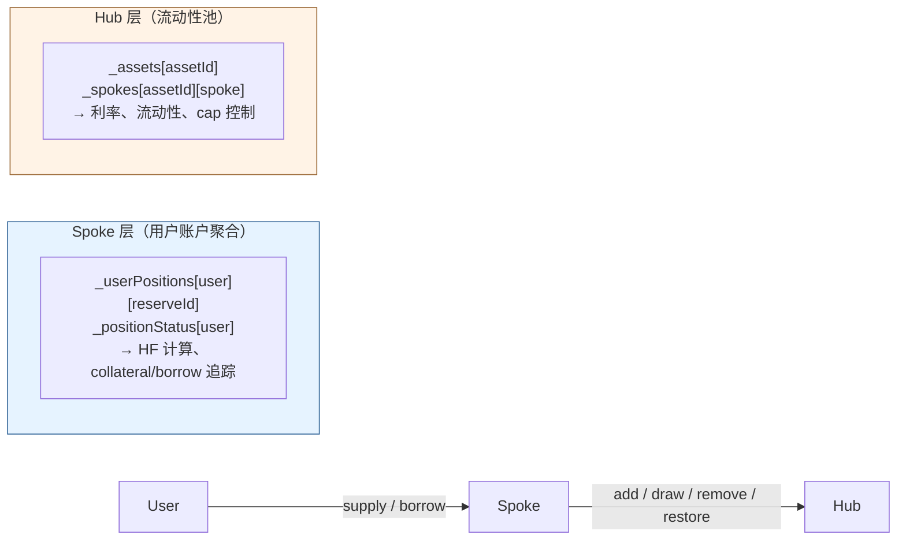

# Aave V4 Hub-Spoke 仓位隔离与跨 Hub 抵押

---

## 一、核心结论

| 场景 | 能否用 A 的 collateral 借 B？ | 原因 |
|------|:----------------------------:|------|
| SpokeA supply → SpokeB borrow（不同 Spoke） | **不能** | 仓位按 Spoke 隔离，SpokeB 看不到 SpokeA 的 collateral |
| Spoke 内 hub1 supply → Spoke 内 hub2 borrow（同 Spoke 不同 Hub） | **能** | 同一 Spoke 内所有 reserveId 的 collateral 统一计算 HF，不区分 Hub |
| Spoke 内 hub1 assetId=A supply → Spoke 内 hub1 assetId=B borrow（同 Spoke 同 Hub） | **能** | 最基本场景，同上 |

**一句话：Spoke 是用户仓位的隔离边界，Hub 不是。**

---

## 二、架构角色



| 层 | 职责 | 仓位数据 | 流动性数据 |
|----|------|---------|-----------|
| **Spoke** | 用户交互面、账户管理、HF 验证 | `_userPositions[user][reserveId]`、`_positionStatus[user]` | — |
| **Hub** | 流动性协调、利率计算、cap 控制 | — | `_assets[assetId]`、`_spokes[assetId][spoke]` |

---

## 三、跨 Spoke 隔离：详细机制

### 3.1 存储隔离

每个 Spoke 合约有独立的 contract storage：

```solidity
// SpokeStorage.sol
mapping(address user => mapping(uint256 reserveId => ISpoke.UserPosition))
    internal _userPositions;     // 仓位数据：per Spoke

mapping(address user => ISpoke.PositionStatus)
    internal _positionStatus;    // collateral/borrowing bitmap：per Spoke
```

`reserveId` 由 `_reserveCount++` 自增分配，是 **Spoke 本地** ID。同一用户地址在 SpokeA 和 SpokeB 中有**各自独立的** `_userPositions` 和 `_positionStatus`。

> 源码：`src/spoke/SpokeStorage.sol:28-33`

### 3.2 Health Factor 只看当前 Spoke

`_processUserAccountData` 遍历当前 Spoke 的 `_positionStatus[user]`，不跨 Spoke、不跨 Hub：

```solidity
// Spoke.sol:718-767（核心循环）
PositionStatus storage positionStatus = _positionStatus[user];
while (true) {
    (reserveId, borrowing, collateral) = positionStatus.next(reserveId);
    if (reserveId == PositionStatusMap.NOT_FOUND) break;

    UserPosition storage userPosition = _userPositions[user][reserveId];
    Reserve storage reserve = _reserves[reserveId];
    // 累加 collateral 和 debt，不区分 Hub
}
// healthFactor = avgCollateralFactor * RAY / totalDebtValueRay
```

> 源码：`src/spoke/Spoke.sol:706-813`

### 3.3 Hub 不维护用户仓位

Hub 只存储全局资产级会计（总 suppliedShares、总 drawnShares、利率等），不记录每个用户在哪个 Spoke 有多少 collateral。因此不存在跨 Spoke 的仓位查询机制。

> 源码：`src/hub/HubStorage.sol:16-22`；文档 `docs/overview.md:43`

### 3.4 测试佐证

`Spoke.Borrow.Scenario.t.sol:393` 的多 Spoke 测试中，用户在 spoke1 和 spoke2 **各自** supply collateral 后才能 **各自** borrow——不存在"在 SpokeA supply collateral、仅在 SpokeB borrow"的场景。

---

## 四、同 Spoke 跨 Hub 抵押：详细机制

### 4.1 PositionStatus bitmap 不区分 Hub

`_positionStatus[user]` 按 reserveId 编号，同一 Spoke 内所有 reserveId（无论关联哪个 Hub）共享同一个 bitmap：

- 每个 reserveId 占 2 bit：bit 0 = borrowing，bit 1 = collateral
- `next()` 扫描所有活跃位，循环内无 Hub 过滤

> 源码：`src/spoke/libraries/PositionStatusMap.sol:22-51`

### 4.2 同一 underlying token 在不同 Hub 有不同 reserveId

```solidity
// Spoke.sol:121-165
function addReserve(address hub, uint256 assetId, ...) {
    require(!_isAssetIdListed(hub, assetId, ...), ReserveExists());
    uint256 reserveId = _reserveCount++;        // 全局递增
    _hubAssetIdToReserveId[hub][assetId] = reserveId;
    // 同一 underlying token 在 hub1 → reserveId=0, hub2 → reserveId=1
}
```

> 源码：`src/spoke/Spoke.sol:121-165`、`src/spoke/SpokeStorage.sol:20-22`

### 4.3 HF 计算统一累加

`_processUserAccountData` 对所有 reserveId 的 collateral value 统一累加到 `totalCollateralValue`，所有 debt 统一累加到 `totalDebtValueRay`，**不按 Hub 分组**。hub1 的 collateral 可以覆盖 hub2 的 debt。

### 4.4 测试佐证

| 测试 | 文件 | 场景 |
|------|------|------|
| `test_borrow_secondHub` | `Spoke.MultipleHub.t.sol:90` | Bob 只在 hub1 supply collateral，直接在 hub2 borrow DAI |
| `test_borrow_thirdHub` | `Spoke.MultipleHub.t.sol:175` | hub3 的 collateral 覆盖 hub1 的 debt，Bob 从 hub1 withdraw 全部 DAI |
| IsolationMode | `Spoke.MultipleHub.IsolationMode.t.sol:149` | newHub 上的 assetA collateral borrow canonical hub1 上的 assetB |
| SiloedBorrowing | `Spoke.MultipleHub.SiloedBorrowing.t.sol:149` | canonical hub1 的 assetA collateral borrow newHub 上的 assetB |

---

## 五、跨 Hub 的控制机制

跨 Hub borrow 不是无条件允许，Hub 侧通过 **addCap / drawCap** 精细控制：

| 参数 | 控制对象 | 设为 0 的效果 |
|------|---------|-------------|
| `addCap` | 该 Spoke 向该 Hub asset 的 supply 上限 | 禁止该 Spoke 向该 Hub supply（但可 borrow） |
| `drawCap` | 该 Spoke 从该 Hub asset 的 borrow 上限 | 禁止该 Spoke 从该 Hub borrow（但可 supply） |

典型模式：

| 模式 | addCap | drawCap | 含义 |
|------|--------|---------|------|
| **IsolationMode** | 0 | >0 | 只允许 borrow，不允许 supply（新 Spoke 从 canonical Hub 借流动性但不向其供应） |
| **SiloedBorrowing** | >0 | 0 | 只允许 supply，不允许 borrow（新 Spoke 向 canonical Hub 供应流动性但不在其上借款） |
| **双向开放** | >0 | >0 | supply 和 borrow 均允许 |

> 源码：`src/hub/Hub.sol:814-858`（`_validateAdd` / `_validateDraw`）

---

## 六、PositionManager 的角色

PositionManager 是可选的辅助合约，可注册多个 Spoke（`_registeredSpokes` 映射），通过 multicall 在多个 Spoke 上代为执行操作。但它**不改变仓位隔离**——只是"代理执行"，不会合并不同 Spoke 的 collateral 视图。

> 源码：`src/position-manager/PositionManagerBase.sol:19-20`

---

## 七、形式化验证现状

当前代码库**没有**对仓位隔离属性的形式化证明（无 Certora spec、Halmos 测试等）。

现有验证手段：

| 类型 | 文件 | 验证内容 |
|------|------|---------|
| TypeScript 原型不变量 | `tests/misc/prototype/core.ts` | Hub/Spoke/User 会计一致性（drawnDebt、premiumDebt、suppliedShares 求和一致），**不涉及仓位隔离** |
| Solidity CheckedActions | `tests/helpers/spoke/CheckedActions.sol` | 单操作单调性（supply 后 shares 增加、borrow 后 debt 增加），**不涉及跨 Spoke 隔离** |

仓位隔离是**构造性保证**：Solidity 合约存储隔离 + `_processUserAccountData` 只遍历当前合约的 `_positionStatus`，使得跨 Spoke 访问在语言语义上不可能。若要形式化验证，需证明"不存在任何执行路径能使 SpokeB 的 HF 计算读到 SpokeA 的 `_userPositions`"——目前未做。

---

## 八、Position Isolation 对 `netPositionConstraint` 的推论

### 8.1 NPC offset 必须在同 Spoke 内 resolve

`netPositionConstraint`（NPC）规定：一个 incentive opportunity 的收益仅计入 offset reserve 上的**净仓位**（supply − borrow），而非总 supply。这是 position isolation 的直接推论：

- **跨 Spoke 不合法**：用户在 SpokeA supply 的 collateral 不能对冲 SpokeB 的 borrow（第三节已证），因此 NPC offset reserve 必须与 incentive reserve 处于**同一 Spoke**。
- **同 Spoke 跨 Hub 合法**：同一 Spoke 内 hub1 的 supply 可以对冲 hub2 的 borrow（第四节已证），因此 NPC offset reserve 可以跨 Hub 但不能跨 Spoke。

### 8.2 后端 resolve 的一致性保证

后端 `resolveOffsetReserveIds` 在匹配 offset reserveId 时，使用 **pool + spoke 前缀**约束（`extractPoolSpokePrefix`）：

- **V3**：无 spoke 概念，pool 前缀唯一匹配。
- **V4**：pool + spoke 前缀匹配。同一 pool 不同 spoke 的 reserveId 前缀不同，确保 offset 不会跨 spoke 误匹配。

这与合约层的 position isolation 语义完全一致：后端 resolve 的"同 pool + 同 spoke"约束 = 合约的"同 Spoke 内"约束。

> 后端实现：`packages/aave-fetcher/src/merkl-api.ts` L215-239（`resolveOffsetReserveIds`）、L202-213（`extractPoolSpokePrefix`）

### 8.3 反查 Map 的 4 种地址映射

后端构建 `tokenAddrToReserveId` 时，对每个 reserve 加入 4 种地址映射：

| 映射 key | 地址来源 | 用途 |
|----------|---------|------|
| `chainId:r.tokenAddress` | underlying token | V3 主匹配 |
| `chainId:r.aTokenAddress` | aToken | V3 Merkl explorerAddress 常用 aToken |
| `chainId:r.vTokenAddress` | vToken/debtToken | V3 borrow incentive 的 explorerAddress |
| `chainId:r.spokeAddress` | spoke 合约地址 | V4 opportunity 的 explorerAddress 可能是 spoke 合约 |

反查时用 `chainId:explorerAddress` 查找，确保 V3 的 aToken/vToken 地址和 V4 的 spoke 地址都能正确映射到 reserveId。

> 后端实现：`packages/aave-fetcher/src/merkl-api.ts` L1090-1107
